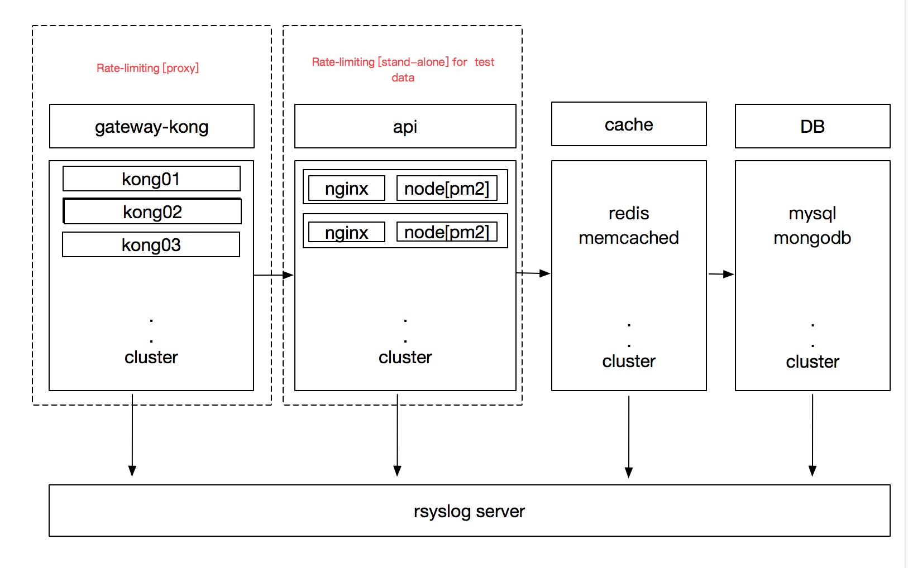

# Abuout to RateLimiting
#### Rate Limiting algorithm

* [Leaky Bucket](https://en.wikipedia.org/wiki/Leaky_bucket) 
* [Token Bucket](https://en.wikipedia.org/wiki/Token_bucket)

   
----

#### Proxy
##### Environment  
	   * kong 0.9.9
	   * kong GUI desktop [kongdash](https://github.com/ajaysreedhar/kongdash) 
	   * kong GUI web [konga](https://github.com/pantsel/konga)
	   * redis 3.x or cluster 
- [kong](https://getkong.org/) [kong-plugins](https://getkong.org/plugins/) **Authentication,Security,Analytics & Monitoring ,Transformations ,Logging**
	* **Traffic Control**
		* [Rate Limiting](https://getkong.org/plugins/rate-limiting)
		* Response rate limiting
		* Request size limiting
- [guava](https://github.com/google/guava)

```
use  kong gui manager to ratelimit setting 
redis is require
```

----
## stand-alone
##### Environment  
    * node -v4.x
    * npm 2.14.x
    * http-perf > 0.0.5 (Stress testing)
    * express 4.x
    * express-rate-limit ^2.6.0 (for local stand-alone)
#### run 
- setting index.js -> limitoptions
- npm test (unit testing)
- npm start 
- npm run nperf(stress testing)
```
 if  limiting http code default 429
 no  limiting console “api no  limiting and count”
```

